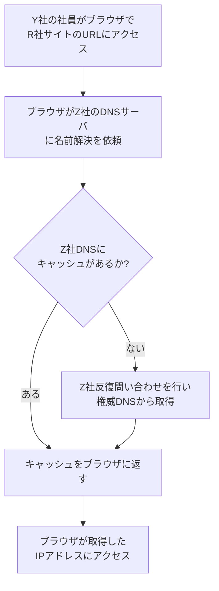

```mermaid
flowchart TB
    A[Y社の社員がブラウザで<br/>R社サイトのURLにアクセス] --> B[ブラウザがZ社のDNSサーバ<br/>に名前解決を依頼]
    B --> C{Z社DNSに<br/>キャッシュがあるか?}
    C -- ある --> D[キャッシュをブラウザに返す]
    C -- ない --> E[Z社反復問い合わせを行い<br/>権威DNSから取得]
    E --> D
    D --> F[ブラウザが取得した<br/>IPアドレスにアクセス]
```
