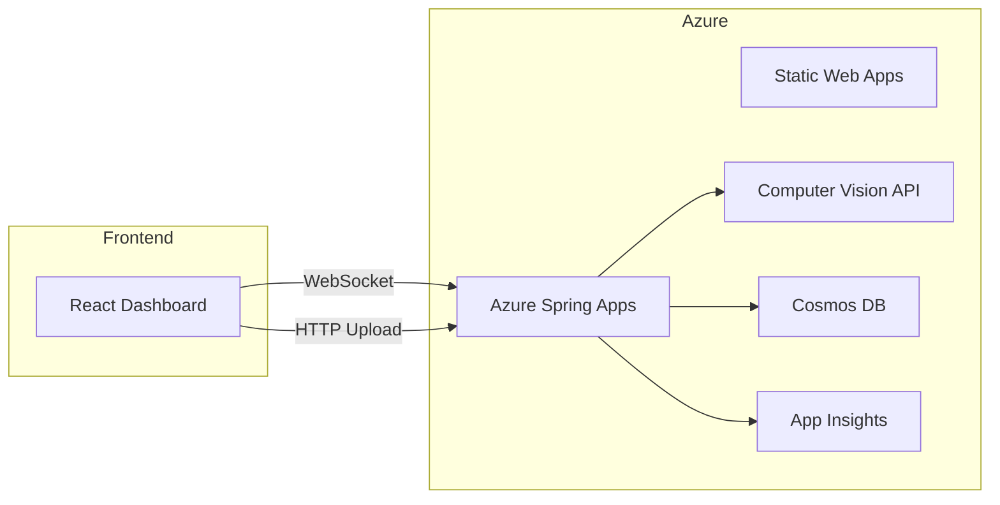

# リアルタイム画像解析ダッシュボード設計仕様

## 1. 基本設計

### 1.1 システム概要／目的

- 目的: 複数ユーザーがアップロードする画像をリアルタイムで解析し、タグ付けや OCR 結果をダッシュボードに即時反映させることで、ビジュアルデータの運用効率を向上させる。
- 対象ユーザー: 検品オペレータ（製品の外観や仕様を確認する担当者）、品質管理担当（製品の品質基準を維持・管理する担当者）、マーケティング部門（市場分析やプロモーション戦略を担当する部門）。
- 利用シーン: 画像撮影直後にアップロード → 自動解析 → 結果確認・フィードバックをリアルタイムに実施。

### 1.2 機能要件一覧

| No. | 機能名               | 概要                                                                   | 優先度 | 備考                           |
| :-: | :------------------- | :--------------------------------------------------------------------- | :----: | :----------------------------- |
|  1  | 画像アップロード機能 | Web UI/モバイルアプリから画像をリアルタイム送信                        |   高   | JPEG/PNG/TIFF                  |
|  2  | WebSocket 通信       | クライアントと双方向通信を確立し、解析結果をプッシュ配信               |   高   | セキュア WebSocket (wss\://)   |
|  3  | 画像解析             | Azure Computer Vision でタグ、OCR、物体検出を実行                      |   高   | 並列処理：Java 21 仮想スレッド |
|  4  | ダッシュボード表示   | 解析結果（タグクラウド、OCR テキスト、バウンディングボックス）を可視化 |   高   | React/Chart.js/Tailwind UI     |
|  5  | エラー・再解析制御   | 失敗時のリトライボタン、解析設定（スコア閾値調整）                     |   中   | クライアント操作               |
|  6  | ログ保存・検索       | Cosmos DB に解析履歴を保存し、日付やタグで検索可能                     |   低   | TTL 設定                       |

### 1.3 非機能要件

| 項目             | 指標                                    | 備考                     |
| :--------------- | :-------------------------------------- | :----------------------- |
| レイテンシ       | P95（95th percentile） ≤ 500ms（解析＋配信） | 同時 100 ユーザー        |
| スケーラビリティ | 200 並列解析タスク（システム全体）       | 仮想スレッド自動スケール |
| 可用性           | 99.9%                                   | Azure SLA                |
| セキュリティ     | 必須: TLS1.2+ / CORS 制御 / JWT 認証、推奨: レート制限（IP ベース） | Azure AD B2C 認証        |
| UX               | モバイルレスポンシブ / アクセシビリティ | WCAG 2.1 AA（Web Content Accessibility Guidelines 2.1 レベル AA: 中程度のアクセシビリティ基準を満たす） |
| 運用・監視       | Application Insights アラート設定       | エラー率 5%以上（1分間あたり）で通知    |

### 1.4 アーキテクチャ図

