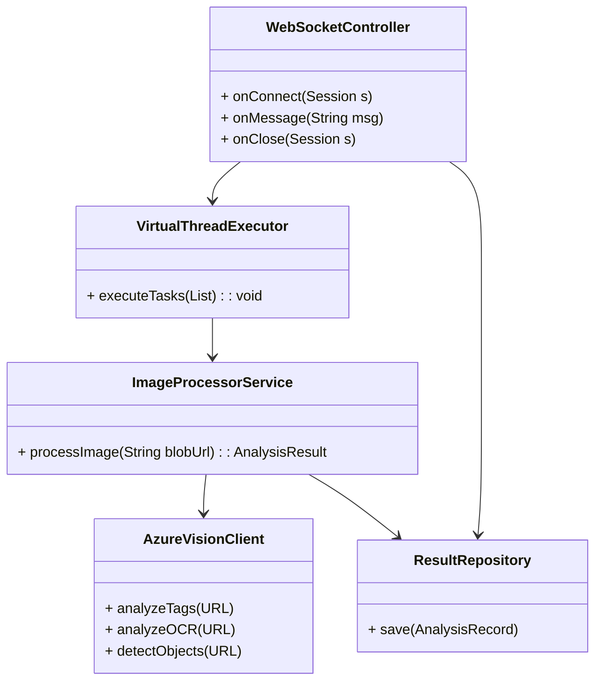
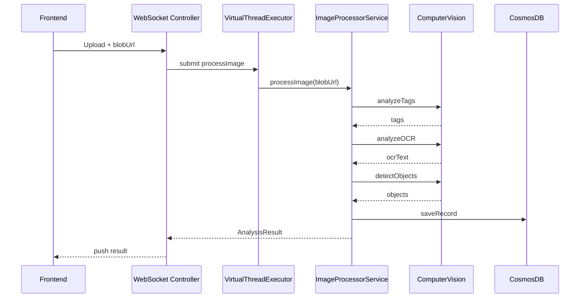

## 2. 詳細設計 (LLD)

---

### 2.1 通信仕様

- **WebSocket エンドポイント**: `wss://<domain>/api/ws/image-analysis`
- **メッセージ形式**:

  - クライアント → サーバー: `{"action":"upload","imageId":"ID","blobUrl":"URL"}`
  - サーバー → クライアント: `{"imageId":"ID","tags":["tag1","tag2"],"ocrText":"...","objects":[{x,y,w,h,label}]}`

### 2.2 バックエンドクラス図／パッケージ構成図

### 2.3 シーケンス図

### 2.4 仮想スレッド活用ポイント

- `Executors.newVirtualThreadPerTaskExecutor()` を利用し、アップロードごとに軽量スレッドで並列処理
- `StructuredTaskScope` でタグ/OCR/検出を同時実行し、最速応答を実現

### 2.5 フロントエンド設計

- **React コンポーネント**:

  - `ImageUploader`: 画像選択・プレビュー
  - `AnalysisDashboard`: 各画像ごとのタグクラウド表示
  - `OCRViewer`: テキスト表示領域
  - `ObjectOverlay`: 画像上にボックス描画

- **状態管理**: React Context + Hooks
- **スタイリング**: Tailwind CSS

### 2.6 インフラ／リソース構成

| リソース              | プラン／SKU    | 数量 | 備考                     |
| :-------------------- | :------------- | :--: | :----------------------- |
| Static Web Apps       | Standard       |  1   | React アプリ             |
| Azure Spring Apps     | S0 (試験) / B1 |  1   | WebSocket 対応           |
| Azure Computer Vision | S1             |  —   | Tag/OCR/Object Detection |
| Azure Cosmos DB       | RU/s=1000      |  1   | メタデータ保存           |
| Application Insights  | B1             |  1   | テレメトリ               |

---
