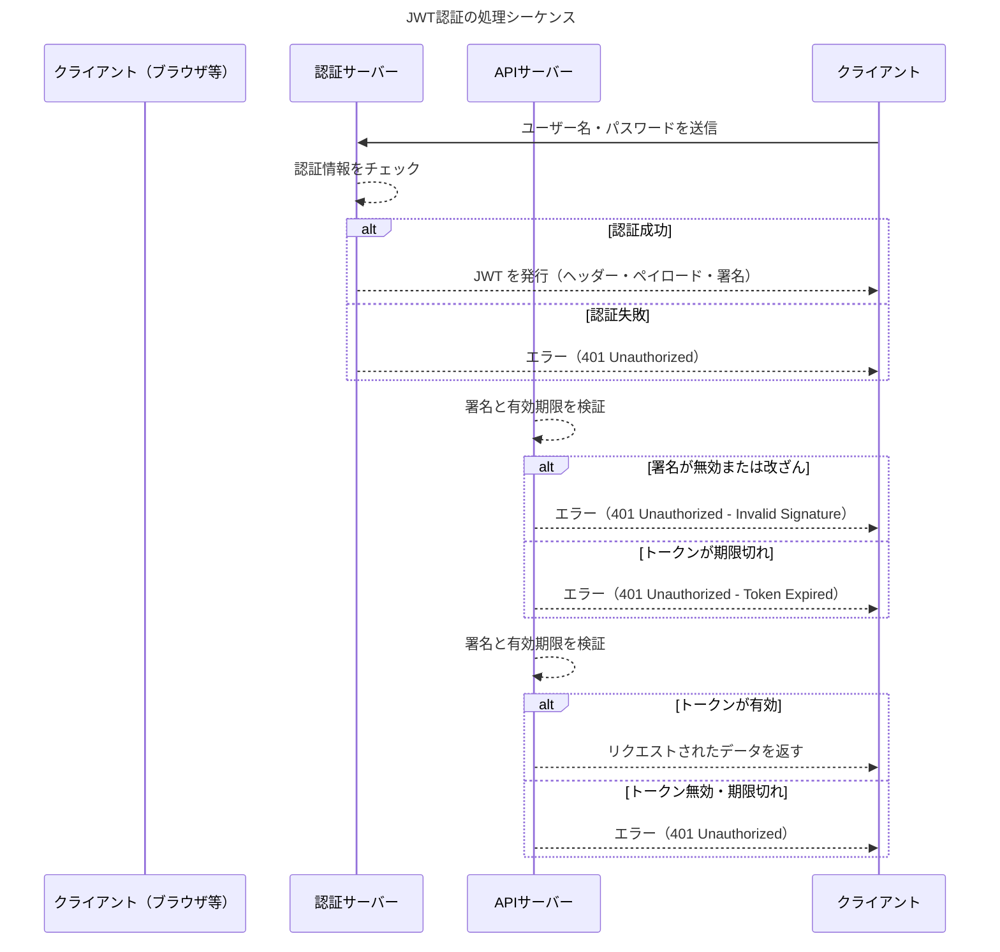

```mermaid
sequenceDiagram
    title JWT認証の処理シーケンス
    participant クライアント（ブラウザ等）
    participant 認証サーバー
    participant APIサーバー

    %% 1. ログイン: ユーザーが認証サーバーにユーザー名とパスワードを送信して認証を試みるプロセス
    クライアント->>認証サーバー: ユーザー名・パスワードを送信
    認証サーバー-->>認証サーバー: 認証情報をチェック
    alt 認証成功
        認証サーバー-->>クライアント: JWT を発行（ヘッダー・ペイロード・署名）
    else 認証失敗
        認証サーバー-->>クライアント: エラー（401 Unauthorized）
    end

    %% 2. JWTを使ったアクセス: JWT (JSON Web Token) is used to securely transmit information between parties, allowing the client to access protected resources by including the token in the Authorization header.
    APIサーバー-->>APIサーバー: 署名と有効期限を検証
    alt 署名が無効または改ざん
        APIサーバー-->>クライアント: エラー（401 Unauthorized - Invalid Signature）
    else トークンが期限切れ
        APIサーバー-->>クライアント: エラー（401 Unauthorized - Token Expired）
    end
    APIサーバー-->>APIサーバー: 署名と有効期限を検証
    alt トークンが有効
        APIサーバー-->>クライアント: リクエストされたデータを返す
    else トークン無効・期限切れ
        APIサーバー-->>クライアント: エラー（401 Unauthorized）
    end
```