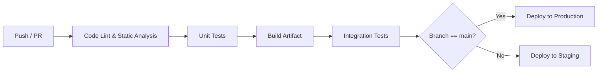
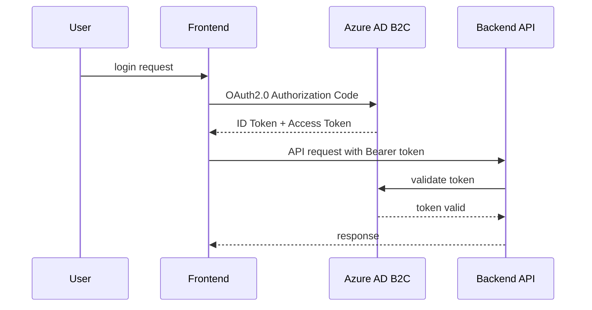

# 運用・デプロイ設計書

---

## 1. CI/CD 設計

### 1.1 パイプライン概要

- 目的: ソースコードの品質担保、自動ビルド・テスト・デプロイの標準化
- 対象リポジトリ: `github.com/<org>/<repo>`
- 主な利用サービス: GitHub Actions または Azure DevOps

### 1.2 ブランチ戦略

| ブランチ名  | 用途             | マージルール                        |
| :---------- | :--------------- | :---------------------------------- |
| `main`      | 本番環境デプロイ | 保護ルール: PR 必須、CI 合格後のみ  |
| `develop`   | 次リリース開発   | PR によるマージ                     |
| `feature/*` | 個別機能開発     | develop へ PR                       |
| `hotfix/*`  | 本番障害対応     | main へ PR、マージ後 develop へ反映 |

### 1.3 パイプラインフロー図

### 1.4 各ステップ詳細

| ステップ               | 実行内容                                    | 使用ツール／アクション                   |
| :--------------------- | :------------------------------------------ | :--------------------------------------- |
| コード静的解析         | ESLint／Checkstyle／SpotBugs                | `actions/checkout`, `actions/setup-java` |
| 単体テスト             | JUnit／Mockito                              | `mvn test`                               |
| ビルド                 | Gradle                                     | `gradle build`                          |
| 結合テスト             | TestContainers／Postman テスト              | カスタムスクリプト                       |
| デプロイ（Staging）    | Azure Functions Deploy / App Service Deploy | Azure CLI Action                         |
| デプロイ（Production） | Blue-Green デプロイ／Slot スワップ          | Azure Deploy Action                      |

---

## 2. セキュリティ設計

### 2.1 認証・認可フロー

### 2.2 シークレット管理

| 種別                 | 保管先                               | 説明                         |
| :------------------- | :----------------------------------- | :--------------------------- |
| API キー             | Azure Key Vault                      | アクセス制御とローテーション |
| DB 接続文字列        | Azure App Configuration or Key Vault | アプリ設定管理               |
| Storage SAS トークン | Key Vault                            | 最小権限での Blob アクセス   |

### 2.3 ネットワーク制御

- VNet 統合: Azure Functions および App Service を VNet に統合
- NSG ルール: 必要ポートのみ許可 (HTTP/HTTPS)
- CORS 設定: フロントドメインのみ許可

---

## 3. 監視／アラート設計

### 3.1 取得メトリクス一覧

| メトリクス       | 収集先               | 頻度         | 用途               |
| :--------------- | :------------------- | :----------- | :----------------- |
| レスポンスタイム | Application Insights | 1 分毎       | SLA 遵守確認       |
| エラー率         | Application Insights | リアルタイム | 障害検知           |
| CPU 使用率       | Azure Monitor        | 5 分毎       | スケーリング判断用 |
| メモリ使用量     | Azure Monitor        | 5 分毎       | リソース逼迫監視   |

### 3.2 アラートルール

| アラート名      | 条件                | 通知チャネル | 備考             |
| :-------------- | :------------------ | :----------- | :--------------- |
| High Error Rate | エラー率 > 5%       | Email, Teams | 即時通知         |
| Slow Response   | P95 レイテンシ > 1s | PagerDuty    | SLA 違反対応     |
| High CPU Usage  | CPU 使用率 > 80%    | Email        | 自動スケール検討 |

---

## 4. 運用手順／トラブル対応

### 4.1 障害エスカレーションフロー

1. アラート受信 → 1st 対応担当者アラート
2. 30 分以内に対応状況を更新
3. 1 時間以内に根本原因分析（RCA）
4. 必要に応じて 2nd チームへエスカレーション

### 4.2 リリース手順

1. PR マージ（main ブランチ）
2. CI/CD による自動デプロイ開始
3. Staging で Smoke Test 実施
4. 自動 Blue-Green スワップ（Production）
5. Post-Deployment Smoke Test
6. 完了報告

### 4.3 ロールバック手順

- 問題発生時、Azure Portal または CLI で前バージョンスロットへスワップ

### 4.4 定期メンテナンス項目

- Key Vault のシークレット有効期限確認（月次)
- Azure リソースのコストレポート確認（月次)
- セキュリティパッチ適用 (四半期)

---