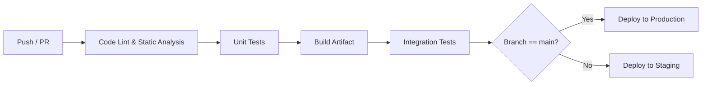

# CI/CD 設計

## 1.1 パイプライン概要

- 目的: ソースコードの品質担保、自動ビルド・テスト・デプロイの標準化
- 対象リポジトリ: `github.com/<org>/<repo>`
- 主な利用サービス: GitHub Actions または Azure DevOps

### 1.2 ブランチ戦略

| ブランチ名  | 用途             | マージルール                        |
| :---------- | :--------------- | :---------------------------------- |
| `main`      | 本番環境デプロイ | 保護ルール: PR 必須、CI 合格後のみ  |
| `develop`   | 次リリース開発   | PR によるマージ                     |
| `feature/*` | 個別機能開発     | develop へ PR                       |
| `hotfix/*`  | 本番障害対応     | main へ PR、マージ後 develop へ反映 |

### 1.3 パイプラインフロー図

### 1.4 各ステップ詳細

| ステップ               | 実行内容                                    | 使用ツール／アクション                   |
| :--------------------- | :------------------------------------------ | :--------------------------------------- |
| コード静的解析         | ESLint／Checkstyle／SpotBugs                | `actions/checkout`, `actions/setup-java` |
| 単体テスト             | JUnit／Mockito                              | `mvn test`                               |
| ビルド                 | Gradle                                      | `gradle build`                           |
| 結合テスト             | TestContainers／Postman テスト              | カスタムスクリプト                       |
| デプロイ（Staging）    | Azure Functions Deploy / App Service Deploy | Azure CLI Action                         |
| デプロイ（Production） | Blue-Green デプロイ／Slot スワップ          | Azure Deploy Action                      |

---
