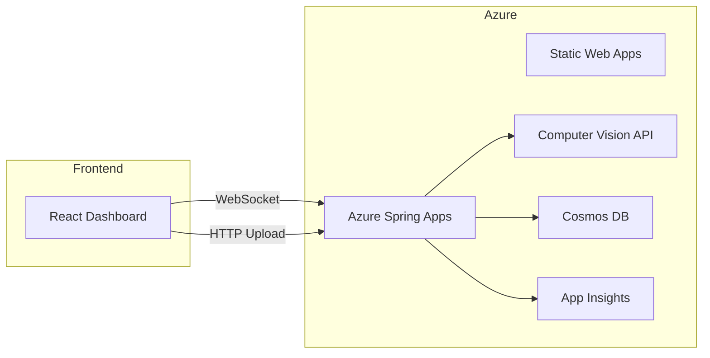
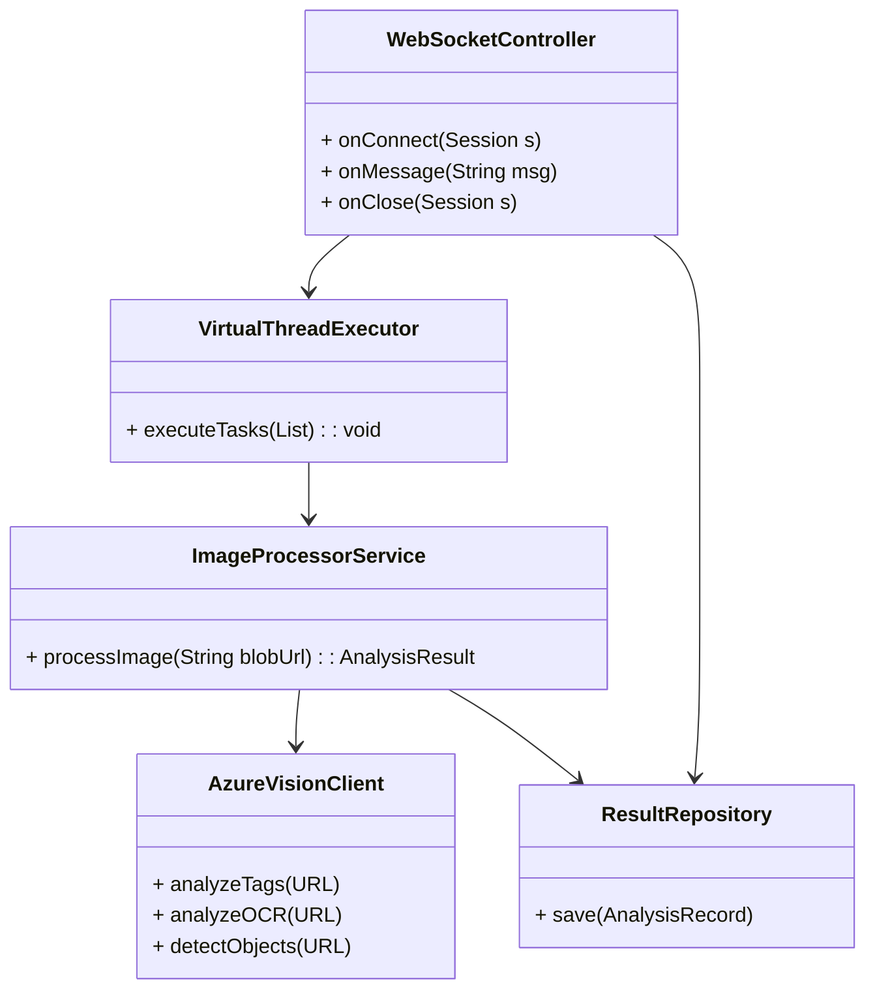
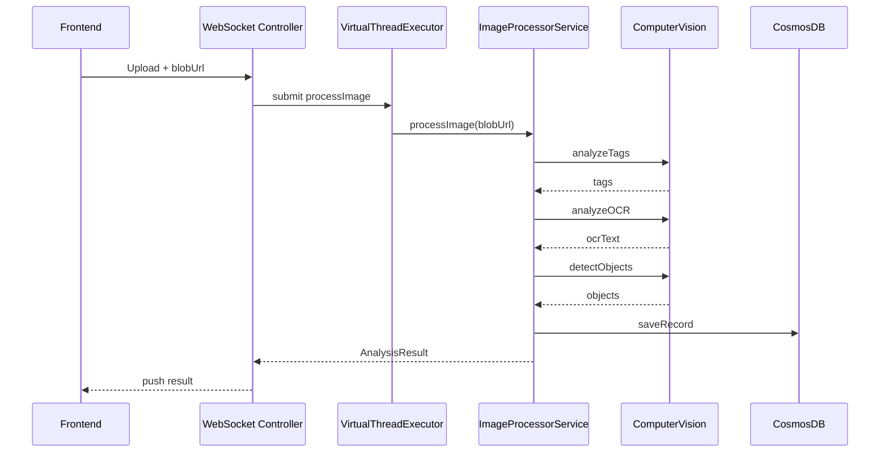

# リアルタイム画像解析ダッシュボード設計仕様

## 1. 要件サマリ

- **主な機能要件**：
  1. 画像アップロード
  2. OCR 解析
  3. 要約生成
  4. レポート出力

## 2. 基本設計

### 2.1 システム概要／目的

- 目的: 複数ユーザーがアップロードする画像をリアルタイムで解析し、タグ付けや OCR 結果をダッシュボードに即時反映させることで、ビジュアルデータの運用効率を向上させる。
- 対象ユーザー: 検品オペレータ（製品の外観や仕様を確認する担当者）、品質管理担当（製品の品質基準を維持・管理する担当者）、マーケティング部門（市場分析やプロモーション戦略を担当する部門）。
- 利用シーン: 画像撮影直後にアップロード → 自動解析 → 結果確認・フィードバックをリアルタイムに実施。

### 2.2 機能要件一覧

| No. | 機能名               | 概要                                                                   | 優先度 | 備考                           |
| :-: | :------------------- | :--------------------------------------------------------------------- | :----: | :----------------------------- |
|  1  | 画像アップロード機能 | Web UI/モバイルアプリから画像をリアルタイム送信                        |   高   | JPEG/PNG/TIFF                  |
|  2  | WebSocket 通信       | クライアントと双方向通信を確立し、解析結果をプッシュ配信               |   高   | セキュア WebSocket (wss\://)   |
|  3  | 画像解析             | Azure Computer Vision でタグ、OCR、物体検出を実行                      |   高   | 並列処理：Java 21 仮想スレッド |
|  4  | ダッシュボード表示   | 解析結果（タグクラウド、OCR テキスト、バウンディングボックス）を可視化 |   高   | React/Chart.js/Tailwind UI     |
|  5  | エラー・再解析制御   | 失敗時のリトライボタン、解析設定（スコア閾値調整）                     |   中   | クライアント操作               |
|  6  | ログ保存・検索       | Cosmos DB に解析履歴を保存し、日付やタグで検索可能                     |   低   | TTL 設定                       |

### 2.3 非機能要件

| 項目             | 指標                                                                | 備考                                                                                                    |
| :--------------- | :------------------------------------------------------------------ | :------------------------------------------------------------------------------------------------------ |
| レイテンシ       | P95（95th percentile） ≤ 500ms（解析＋配信）                        | 同時 100 ユーザー                                                                                       |
| スケーラビリティ | 200 並列解析タスク（システム全体）                                  | 仮想スレッド自動スケール                                                                                |
| 可用性           | 99.9%                                                               | Azure SLA                                                                                               |
| セキュリティ     | 必須: TLS1.2+ / CORS 制御 / JWT 認証、推奨: レート制限（IP ベース） | Azure AD B2C 認証                                                                                       |
| UX               | モバイルレスポンシブ / アクセシビリティ                             | WCAG 2.1 AA（Web Content Accessibility Guidelines 2.1 レベル AA: 中程度のアクセシビリティ基準を満たす） |
| 運用・監視       | Application Insights アラート設定                                   | エラー率 5%以上（1 分間あたり）で通知                                                                   |

### 2.4 アーキテクチャ図

## 3. 詳細設計

### 3.1 通信仕様

- WebSocket エンドポイント: `wss://<domain>/api/ws/image-analysis`
- メッセージ形式:

  - クライアント → サーバー: `{"action":"upload","imageId":"ID","blobUrl":"URL"}`
  - サーバー → クライアント: `{"imageId":"ID","tags":["tag1","tag2"],"ocrText":"...","objects":[{x,y,w,h,label}]}`

### 3.2 バックエンドクラス図／パッケージ構成図

### 3.3 シーケンス図

### 3.4 仮想スレッド活用ポイント

- `Executors.newVirtualThreadPerTaskExecutor()` を利用し、アップロードごとに軽量スレッドで並列処理
- `StructuredTaskScope` でタグ/OCR/検出を同時実行し、最速応答を実現

### 3.5 フロントエンド設計

- React コンポーネント:

  - `ImageUploader`: 画像選択・プレビュー
  - `AnalysisDashboard`: 各画像ごとのタグクラウド表示
  - `OCRViewer`: テキスト表示領域
  - `ObjectOverlay`: 画像上にボックス描画

- 状態管理: React Context + Hooks
- スタイリング: Tailwind CSS

### 3.6 インフラ／リソース構成

| リソース              | プラン／SKU    | 数量 | 備考                     |
| :-------------------- | :------------- | :--: | :----------------------- |
| Static Web Apps       | Standard       |  1   | React アプリ             |
| Azure Spring Apps     | S0 (試験) / B1 |  1   | WebSocket 対応           |
| Azure Computer Vision | S1             |  —   | Tag/OCR/Object Detection |
| Azure Cosmos DB       | RU/s=1000      |  1   | メタデータ保存           |
| Application Insights  | B1             |  1   | テレメトリ               |

---
