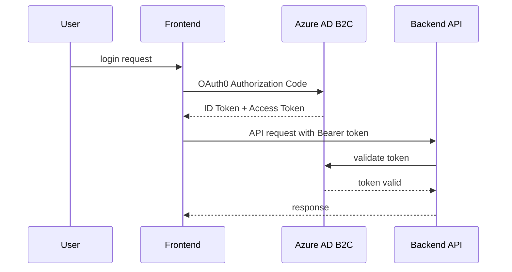

# セキュリティ設計

## 1 認証・認可フロー

## 2 シークレット管理

| 種別                 | 保管先                               | 説明                         |
| :------------------- | :----------------------------------- | :--------------------------- |
| API キー             | Azure Key Vault                      | アクセス制御とローテーション |
| DB 接続文字列        | Azure App Configuration or Key Vault | アプリ設定管理               |
| Storage SAS トークン | Key Vault                            | 最小権限での Blob アクセス   |

## 3 ネットワーク制御

- VNet 統合: Azure Functions および App Service を VNet に統合
- NSG ルール: 必要ポートのみ許可 (HTTP/HTTPS)
- CORS 設定: フロントドメインのみ許可

---
