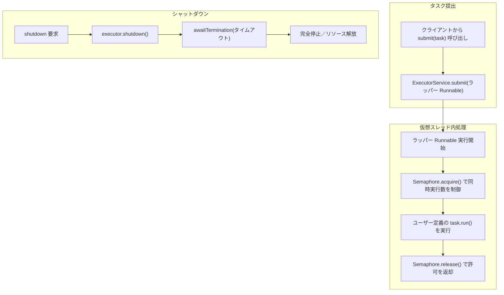

```mermaid
flowchart TD
  subgraph タスク提出
    A["クライアントから submit(task) 呼び出し"] --> B["ExecutorService.submit(ラッパー Runnable)"]
  end

  subgraph 仮想スレッド内処理
    B --> C["ラッパー Runnable 実行開始"]
    C --> D["Semaphore.acquire() で同時実行数を制御"]
    D --> E["ユーザー定義の task.run() を実行"]
    E --> F["Semaphore.release() で許可を返却"]
  end

  subgraph シャットダウン
    G["shutdown 要求"] --> H["executor.shutdown()"]
    H --> I["awaitTermination(タイムアウト)"]
    I --> J["完全停止／リソース解放"]
  end
```