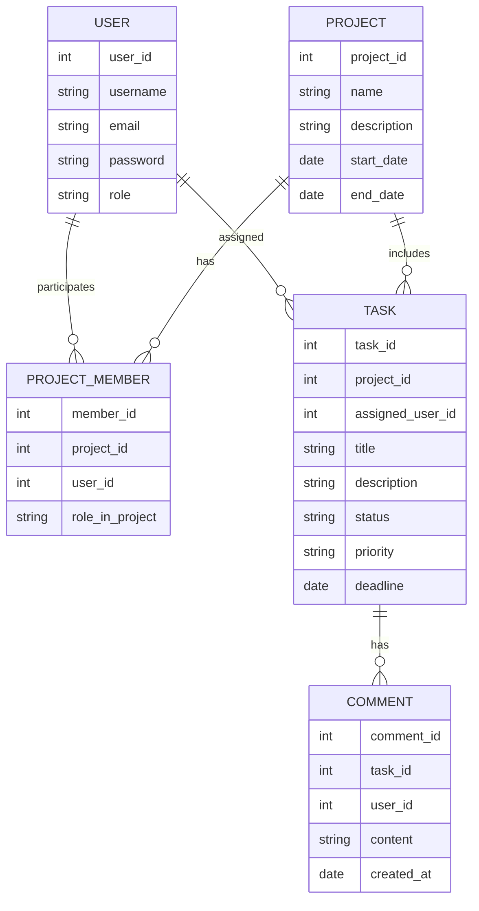

```mermaid
erDiagram
    USER ||--o{ PROJECT_MEMBER : participates
    USER ||--o{ TASK : assigned
    PROJECT ||--o{ PROJECT_MEMBER : has
    PROJECT ||--o{ TASK : includes
    TASK ||--o{ COMMENT : has
    
    USER {
        int user_id
        string username
        string email
        string password
        string role
    }

    PROJECT {
        int project_id
        string name
        string description
        date start_date
        date end_date
    }

    PROJECT_MEMBER {
        int member_id
        int project_id
        int user_id
        string role_in_project
    }

    TASK {
        int task_id
        int project_id
        int assigned_user_id
        string title
        string description
        string status
        string priority
        date deadline
    }

    COMMENT {
        int comment_id
        int task_id
        int user_id
        string content
        date created_at
    }
```