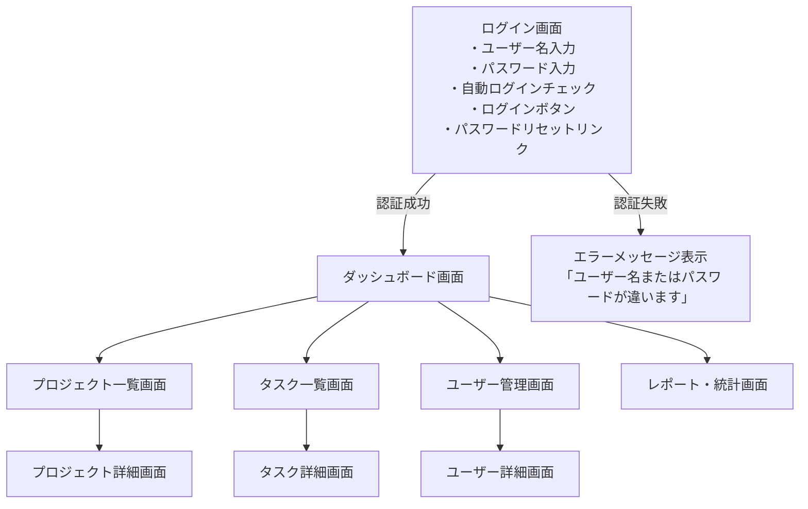

```mermaid
flowchart TD
    %% ログイン画面
    A[ログイン画面<br>・ユーザー名入力<br>・パスワード入力<br>・自動ログインチェック<br>・ログインボタン<br>・パスワードリセットリンク] -->|認証成功| B[ダッシュボード画面]

    A -->|認証失敗| C[エラーメッセージ表示<br>「ユーザー名またはパスワードが違います」]

    %% ダッシュボード画面
    B --> D[プロジェクト一覧画面]
    B --> E[タスク一覧画面]
    B --> F[ユーザー管理画面]
    B --> G[レポート・統計画面]

    %% 詳細画面
    D --> H[プロジェクト詳細画面]
    E --> I[タスク詳細画面]
    F --> J[ユーザー詳細画面]
```